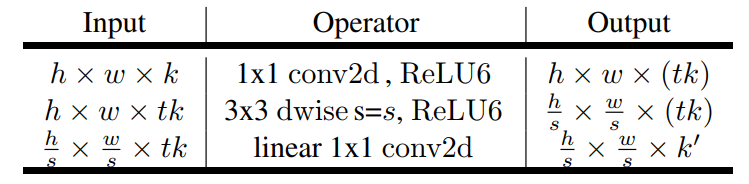
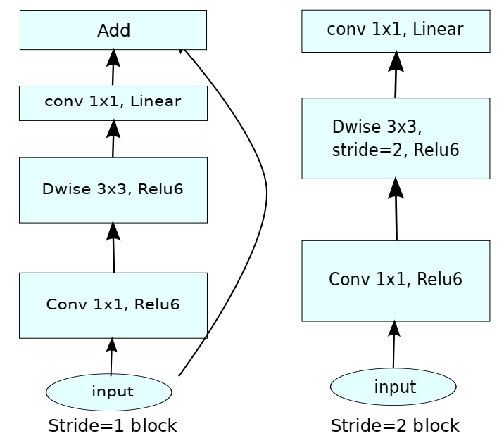

## MobileNetV2
提出了一个全新的Module, `inverted residual with linear bottleneck`

## Method
### 1.  Depth-wise and Point-wise
__Depth-wise__: applying a single convolutional filter per input channel

__Point-wise__: 1*1 Standard Conv Layer to catch the channel relation

### 2. Linear BottleNecks and Inverted Residual Block
Depth-wise存在的问题:
- Depth-wise训练出来的很多位置为空, Depth-wise相对于vanilla conv中的每个kernel dim比较小, 容易学废, 因为ReLU对于0位置输出的梯度为0, 神经元大量死亡
- 如果需要使用Depth-wise + ReLU, 应先升维再降维

通俗理解就是:
- 在channel维度较少的情况下, 不应该和ReLU结合, 很容易导致信息流失, 所以应在维度较高的channel后接ReLU

侧面反应了ResNet比VGG好的地方, ResNet通过残差结构很好地缓解了神经元死亡, 特征退化的问题

__Inverted Residual Block Design__:

#### MobileNetV2 Advantages
MobileNetV2的核心结构设计就是 __Inverted Residual Block__

这个Block的结构是 Point_wise - Depth_wise - Point_wise, 并且去除了最后一层Point_wise的激活函数
- 增加第一个Point_wise的目的是提升维度, 这样可以让DW卷积在更高的维度进行特征提取
- 去除最后一个Point_wise的ReLU是作者认为激活函数在高维空间才能增加非线性, 在低维空间反而会导致信息流失不如线性变化

#### Difference with ResNet
- ResNet使用标准卷积提取特征, MobileNetV2使用Depth-wise卷积
- ResNet先降维再升维, MobileNetV2则是先升维再降维, ResNet网络结构是沙漏型, MobileNetV2则是纺锤型, 这么设计的目的也是希望Depth-wise卷积可以在更高的维度提取特征

## Reference
- [通俗易懂理解--MobileNetV1 & MobileNetV2](https://zhuanlan.zhihu.com/p/67872001)