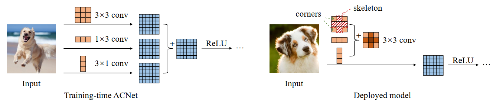
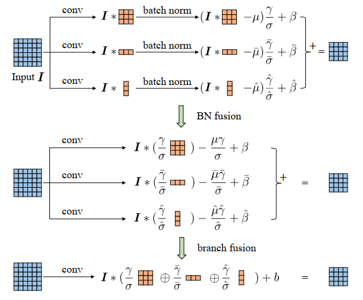
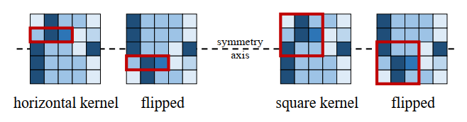
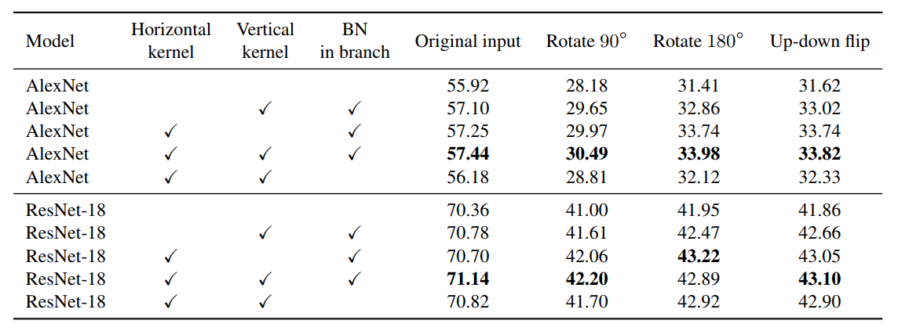
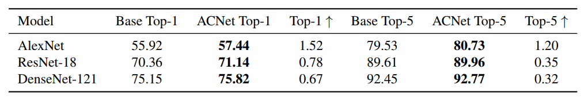

## ACNet
本质上是改进卷积核, 为了获取更好的特征表达, 但是在推理阶段没有增加额外的超参数以及计算量

### Method
假设有两个卷积核 `Conv1` 和 `Conv2`, 一个输入特征`X`

卷积等式:
```
Conv1(X) + Conv2(X) = (Conv1 + Conv2)(X)
```

卷积本质上是矩阵相乘, `两个卷积结果求和`其实等价于一个参数是`两个卷积核参数之和`的卷积结果

### Overview



- ACNet在训练阶段使用了三种不同的卷积, 在Inference阶段将三种卷积的值求和, 得到与训练时等价的结果, 但是并没有增加参数量和计算量
- 训练阶段强化网络的特征提取能力, 强化卷积核的能力, 但是在测试阶段却不需要额外增加计算量, 对精度无痛提升

### Details
#### 1. BatchNorm Fusion

在三个不同的branch都使用了BatchNorm, 在测试阶段整合三个BatchNorm的参数, 得到等价的结果

#### 2. Why does it work?
使用了1×3和3×1的卷积核, 可以提升模型对于图像翻转和旋转的鲁棒性

- `horizontal kernel` are more robust to `up-down` flipping, 当图像进行上下翻转的时候, 通过上图可以清楚的看到相同位置提取出来的特征还是一致的

从实验角度解释模型鲁棒性:


#### 3. BatchNorm in branch before fusion
BatchNorm操作可以放在两个不同的位置:
- BatchNorm可以发生在每个branch之内, 然后再整合BatchNorm一起进行fusion __(better)__
- 先对卷积核进行fusion再进行BatchNorm操作

通过在第二点中展示的对比实验图可以看出来, 第一种方式更好, 即把BatchNorm放在每个branch内

#### 4. Experiments on Imagenet

对比`Alexnet`提升了2个点, 对比其他模型也均有一个点左右的提升, 但考虑到在推理阶段并不会增加额外的参数和计算量, 而且少了很多碎片化的操作, 还是很划算的.

### Code
即插即用的block:
```python
import torch
import torch.nn as nn
# 去掉因为3×3卷积的padding多出来的行和列
class CropLayer(nn.Module):

    #   E.g., (-1, 0) means this layer should crop the first and last rows of the feature map. And (0, -1) crops the first and last columns
    def __init__(self, crop_set):
        super(CropLayer, self).__init__()
        self.rows_to_crop = - crop_set[0]
        self.cols_to_crop = - crop_set[1]
        assert self.rows_to_crop >= 0
        assert self.cols_to_crop >= 0
    
    def forward(self, input):
        return input[:, :, self.rows_to_crop:-self.rows_to_crop, self.cols_to_crop:-self.cols_to_crop]

# 3×3 + 1×3 + 3×1
class ACBlock(nn.Module):

    def __init__(self, in_channels, out_channels, kernel_size, stride=1, padding=0, dilation=1, groups=1, padding_mode='zeros', deploy=False):
        super(ACBlock, self).__init__()
        self.deploy = deploy
        if deploy:
            self.fused_conv = nn.Conv2d(in_channels=in_channels, out_channels=out_channels, kernel_size=(kernel_size,kernel_size), stride=stride,
                                      padding=padding, dilation=dilation, groups=groups, bias=True, padding_mode=padding_mode)
        else:
            self.square_conv = nn.Conv2d(in_channels=in_channels, out_channels=out_channels,
                                         kernel_size=(kernel_size, kernel_size), stride=stride,
                                         padding=padding, dilation=dilation, groups=groups, bias=False,
                                         padding_mode=padding_mode)
            self.square_bn = nn.BatchNorm2d(num_features=out_channels)

            center_offset_from_origin_border = padding - kernel_size // 2
            ver_pad_or_crop = (center_offset_from_origin_border + 1, center_offset_from_origin_border)
            hor_pad_or_crop = (center_offset_from_origin_border, center_offset_from_origin_border + 1)
            if center_offset_from_origin_border >= 0:
                self.ver_conv_crop_layer = nn.Identity()
                ver_conv_padding = ver_pad_or_crop
                self.hor_conv_crop_layer = nn.Identity()
                hor_conv_padding = hor_pad_or_crop
            else:
                self.ver_conv_crop_layer = CropLayer(crop_set=ver_pad_or_crop)
                ver_conv_padding = (0, 0)
                self.hor_conv_crop_layer = CropLayer(crop_set=hor_pad_or_crop)
                hor_conv_padding = (0, 0)
            self.ver_conv = nn.Conv2d(in_channels=in_channels, out_channels=out_channels, kernel_size=(3, 1),
                                      stride=stride,
                                      padding=ver_conv_padding, dilation=dilation, groups=groups, bias=False,
                                      padding_mode=padding_mode)

            self.hor_conv = nn.Conv2d(in_channels=in_channels, out_channels=out_channels, kernel_size=(1, 3),
                                      stride=stride,
                                      padding=hor_conv_padding, dilation=dilation, groups=groups, bias=False,
                                      padding_mode=padding_mode)
            self.ver_bn = nn.BatchNorm2d(num_features=out_channels)
            self.hor_bn = nn.BatchNorm2d(num_features=out_channels)


    # forward函数
    def forward(self, input):
        if self.deploy:
            return self.fused_conv(input)
        else:
            square_outputs = self.square_conv(input)
            square_outputs = self.square_bn(square_outputs)
            # print(square_outputs.size())
            # return square_outputs
            vertical_outputs = self.ver_conv_crop_layer(input)
            vertical_outputs = self.ver_conv(vertical_outputs)
            vertical_outputs = self.ver_bn(vertical_outputs)
            # print(vertical_outputs.size())
            horizontal_outputs = self.hor_conv_crop_layer(input)
            horizontal_outputs = self.hor_conv(horizontal_outputs)
            horizontal_outputs = self.hor_bn(horizontal_outputs)
            # print(horizontal_outputs.size())
            return square_outputs + vertical_outputs + horizontal_outputs
```

### Reference
非常感谢BBuf哥的精彩解读
- [BBuf的知乎](https://zhuanlan.zhihu.com/p/131282789)
- [ACNet](https://arxiv.org/pdf/1908.03930.pdf)