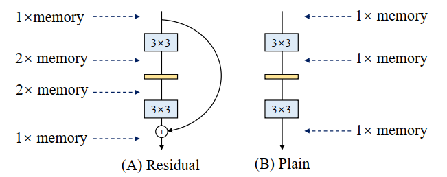
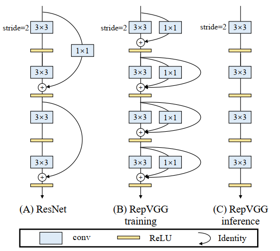
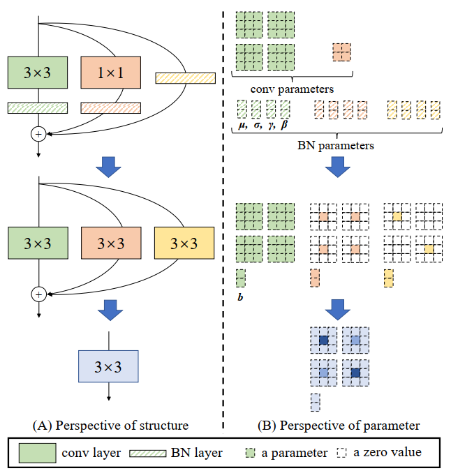

## RepVGG
### Method
通过`re-parameterization`的方法, 让`VGG-like`的大型网络也具备足够的推理能力, 以及较快的推理速度

Advantages:
- VGG-like topology without any branches.
- model's body uses only `3×3 conv` and `ReLU`.
- no automatic search, manual refinement, compound scaling, nor other heavy designs.

### Single-path vs Multi-branch
`Single-path`: `fast`, `memory-economical`, `flexible`

如图所示: Single-path的memory-use小很多

`Multi-branch`对模型并行化有影响, 减慢推理速度, 并且显存占用增大

### Overview

RepVGG在训练的时候和推理的时候拥有不同的结构
- 训练时`multi-branch`
- inference时通过`re-parameterization`方法重新整合参数, 形成只包含`3×3 Conv`和`ReLU`的拓扑结构. 

在推理阶段的`re-parameterization`操作: `BatchNorm`和`Identity`看作是`1×1的kernel`, 通过一个简单的`padding=1`操作融合, 再与`3×3的卷积核`进行求和, 形成Inference阶段的卷积核, 如果有Bias的话, 最后的Bias是三个部分Bias的求和

### Code
