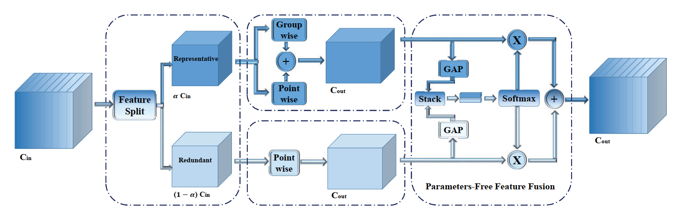

## Split Based Convolution
### Method
本质上是`multi-path`的处理问题, 在CNN中`redundant feature maps`是很常见的现象, 作者提出了一种方法来处理这种pattern, 并且需要更少的计算.

### Overview

整体分成三个部分
- feature split
- conv
- parameter-free fusion

将特征分成两路处理, 对特征表达部分做比较复杂的计算, 对可能冗余的部分做轻量化的计算
- `representative` part: `heavy computation`
- `uncertain redundant` part: `light-weight operation`

### Details
1. `ghostnet` 和 `OctConv` 都对全部的特征进行卷积, 然而其中有些冗余的feature map, 因此可想而知有部分conv操作也是冗余的, SPConv先按照一定的ratio将输入feature map分成两个part。
2. 对于`representative`部分, 用`group conv`和`point-wise conv`再分解, 将二者的结果相加, 来减少因`group conv`阻断的channel之间的交互带来的影响, 同时还能进一步减少计算量
3. 对于`uncertain reduntant`部分, 用 `1×1 kernel_size` 来捕捉细节
4. 因为这两路特征是进行完全不同的处理, 所以需要引入`fusion`部分来控制信息的交互, 增强表达
5. `parameter-free fusion`部分, 对两路特征分别使用`global average pooling`生成`channel-wise statistics`, 将pooling结果stack后进行softmax操作, 来判断两个path特征的attention, 再根据attention的结果加权求和

### Addition
- 每个path的out_channels都是这个module所需要的out_channels
- in_channels=32, out_channels=64, 具体做法是将32的in_channels分成两个16的sub_channels, 然后对于每个path, 都卷积到out_channels大小, 而不是将out_channels也分成两个部分, 具体的可以看以下代码

### Code

```python
import torch
import torch.nn as nn
# 文中只用了3x3的SPConv
class SPConv_3x3(nn.Module):
    def __init__(self, inplanes, outplanes, stride=1, ratio=0.5):
        super(SPConv_3x3, self).__init__()
        self.stride = stride
        self.outplanes = outplanes
        
        # divide channels by ratio, 3x3 = representative part, 1x1 = reduntant part
        self.inplanes_3x3 = int(inplanes*ratio)
        self.inplanes_1x1 = inplanes - self.inplanes_3x3
        self.outplanes_3x3 = int(outplanes*ratio)
        self.outplanes_1x1 = outplanes - self.outplanes_3x3
        
        # define group-conv and point-wise conv for representative part (3x3)
        # group = 2, stride=stride
        self.gwc = nn.Conv2d(self.inplanes_3x3, self.outplanes, kernel_size=3, stride=self.stride,
                     padding=1, groups=2, bias=False)
        self.pwc = nn.Conv2d(self.inplanes_3x3, self.outplanes, kernel_size=1, bias=False)
        
        # define point wise conv for reduntant part (1x1)
        self.conv1x1 = nn.Conv2d(self.inplanes_1x1, self.outplanes, kernel_size=1)
        self.avgpool_s2_1 = nn.AvgPool2d(kernel_size=2,stride=2)
        self.avgpool_3x3 = nn.AvgPool2d(kernel_size=2, stride=2)
        self.avgpool_add_1 = nn.AdaptiveAvgPool2d(1)
        self.avgpool_add_3 = nn.AdaptiveAvgPool2d(1)
        self.bn1 = nn.BatchNorm2d(self.outplanes)
        self.bn2 = nn.BatchNorm2d(self.outplanes)
        self.ratio = ratio
        self.groups = int(1/self.ratio)

    def forward(self, x):
        b, c, _, _ = x.size()
        # split input channels into two sub-channels 
        x_3x3 = x[:,:int(c*self.ratio),:,:]
        x_1x1 = x[:,int(c*self.ratio):,:,:]
        
        # representative part
        # if stride = 2, use avgpool to control the size
        # (group-conv and point-wise conv) -- add the result -- batchnorm -- use global-avgpool to compute the statistic of each channel
        gwc_output = self.gwc(x_3x3)
        if self.stride ==2:
            x_3x3 = self.avgpool_3x3(x_3x3)
        pwc_output = self.pwc(x_3x3)
        out_3x3 = gwc_output + pwc_output
        out_3x3 = self.bn1(out_3x3)
        out_3x3_ratio = self.avgpool_add_3(out_3x3).squeeze(dim=3).squeeze(dim=2)
        
        # uncertain reduntant part
        # (1x1 conv) -- batchnorm -- global-avgpool
        # use avgpool first to reduce information lost
        if self.stride == 2:
            x_1x1 = self.avgpool_s2_1(x_1x1)
        out_1x1 = self.conv1x1(x_1x1)
        out_1x1 = self.bn2(out_1x1)
        out_1x1_ratio = self.avgpool_add_1(out_1x1).squeeze(dim=3).squeeze(dim=2)
        
        # parameter-free fusion
        # (stack two path feature) -- softmax -- element-wise add
        out_31_ratio = torch.stack((out_3x3_ratio, out_1x1_ratio), 2)
        out_31_ratio = nn.Softmax(dim=2)(out_31_ratio)

        out = out_1x1 * (out_31_ratio[:,:,1].view(b, self.outplanes, 1, 1).expand_as(out_1x1))\
              + out_3x3 * (out_31_ratio[:,:,0].view(b, self.outplanes, 1, 1).expand_as(out_3x3))

        return out
```
