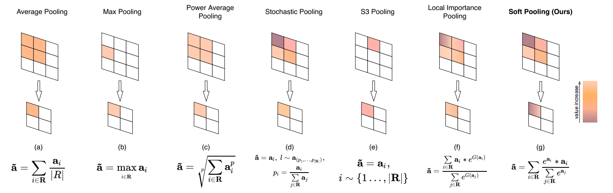
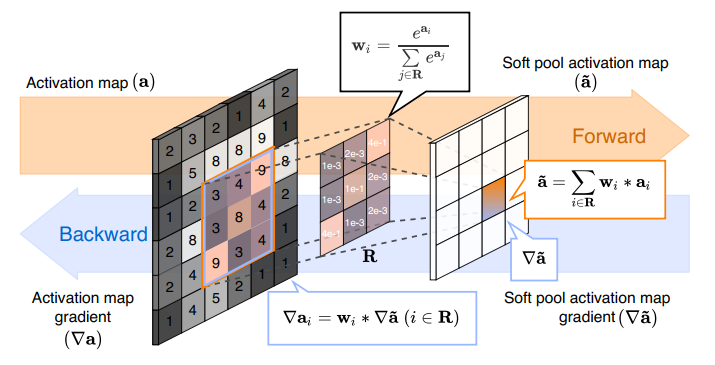

## Split Based Convolution
### Method
将一个`kernel`中`每个grid`的`所有通道`的值`求和`，每个值作为一个grid的`statistics`, 然后对这个statistics进行`softmax`操作, 这个kernel所产生的值是`所有grid根据计算的softmax值加权求和`产生的

### Overview



### Code
这里只展示最基本的实现, 源码中作者还实现了CUDA版本用以加速运算.
```python
import torch.nn.functional as F
import torch
from torch.nn.modules.utils import _triple, _pair, _single
def soft_pool2d(x, kernel_size=2, stride=None, force_inplace=False):
    ... # 这里隐去了源码中的CUDA部分
    kernel_size = _pair(kernel_size)
    if stride is None:
        stride = kernel_size
    else:
        stride = _pair(stride)
    # Get input sizes
    _, c, h, w = x.size()
    # Create per-element exponential value sum : Tensor [b x 1 x h x w]
    e_x = torch.sum(torch.exp(x),dim=1,keepdim=True)
    # Apply mask to input and pool and calculate the exponential sum
    # Tensor: [b x c x h x w] -> [b x c x h' x w']
    return F.avg_pool2d(x.mul(e_x), kernel_size, stride=stride).mul_(sum(kernel_size)).div_(F.avg_pool2d(e_x, kernel_size, stride=stride).mul_(sum(kernel_size)))
```
源码中的几个部分拆解:
- compute grid statistics:
```
e_x = torch.sum(torch.exp(x), dim=1, keepdim=True)
```
这样可以得到每个grid中, 所有channel值求和后进行exp操作的值

- softmax:
```
# split softmax into two parts, sum and divide
# Use avg_pool instead of unfold operation

# part-one: sum of e^xi * xi
F.avg_pool2d(x.mul(e_x), kernel_size, stride=stride).mul_(sum(kernel_size))

# part-two: sum of e^xi
F.avg_pool2d(e_x, kernel_size, stride=stride).mul_(sum(kernel_size))

# divide
(part-one).div_(part-two)
```