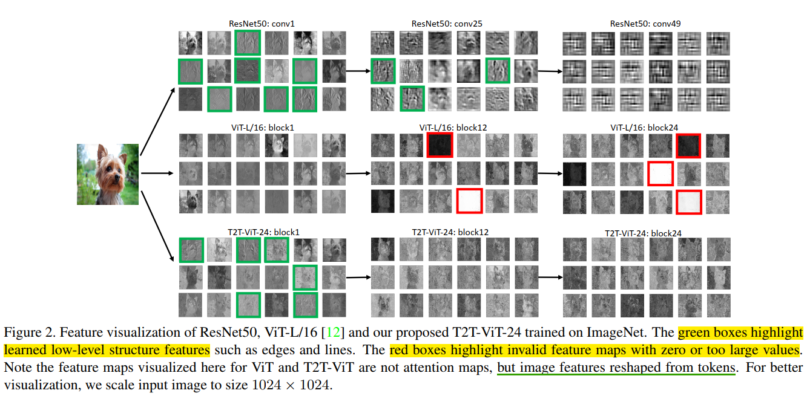
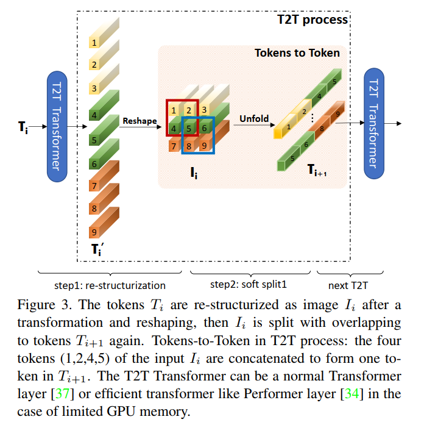
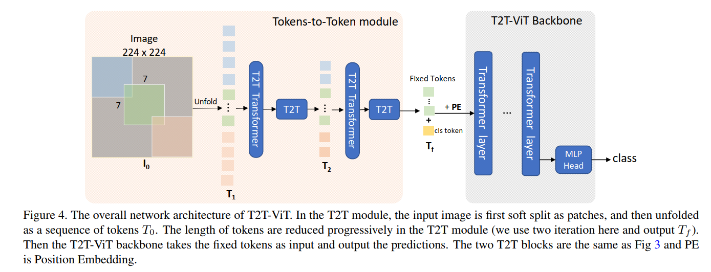
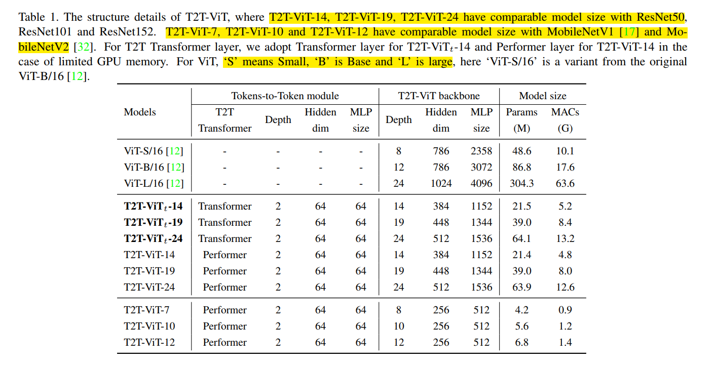
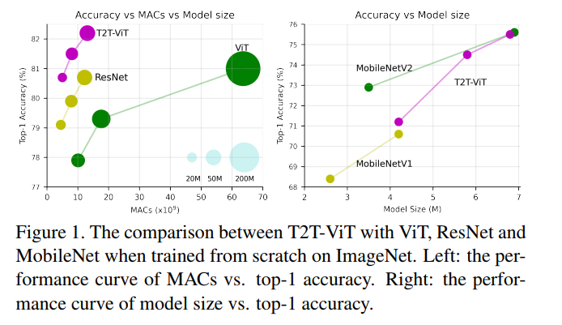

## T2T-ViT
本篇文章主打的点是`Training From Scratch`, 在`midsize dataset Imagenet`上从头训练的结果超越ResNet

### Rethinking ViT Training Procedure
ViT在大规模数据集上预训练后，在`Imagenet`, `Cifar100`, `Cifar10`上表现出了SOTA性能, 但是在Imagenet上从头训练ViT和CNN, ViT的结果相较于CNNs比较差.

导致ViT在Imagenet上从头训练表现不好的原因可能有以下两个点:
* 简单对输入进行tokenization操作(ViT中tokenization操作是使用了一层CNN), 容易丢失重要的局部信息, 类似`edges`, `lines`, ViT中的`tokenization`操作是一种`hard split`操作, 这种强硬式地划分结构, 可能导致难以对局部信息建模
* 在训练过程中的`redundant attention back-bone`设计所产生的特征图丰富性不足

### Visualization

文中通过对`ResNet`, `ViT`的特征图可视化发现, CNNs可以捕捉到更加详细的local structure, 而ViT中却存在很多无效的特征图, 并且难以建模局部特征

### Overview
#### 1. T2T Module
T2T: Tokens to token操作, 文章将这个模块替换ViT中的第一层CNN操作, 将hard-split分解为soft-split, 每个token的产生并不是直接通过kernel_size和stride强硬划分, 通过几个有重叠区域的token aggregate而成的


T2T模块的操作:
* Reshape: 对输入的tokens进行reshape操作, 还原为具有h和w的feature map
* Unfold: Unfold操作是将几个局部的token, 在纵向区域cat起来, 再进行self-attention操作
* Unfold可以看作是一种soft-split的操作, 通过设置stride和padding, 可以让生成的token中具有交叉区域的特征

T2T模块将ViT中的tokenization进行了拆解
* ViT
```
CNN - Transformer Layer
```
* T2T
```
Unfold - SA - Reshape - Unfold - SA - Reshape - Unfold - Project - Transformer 
```
- SA: `Self Attention`
- Unfold: `nn.Unfold`

#### 2. T2T-ViT Model

模型的整体结构如上图所示
- 替换了ViT中的第一层为具有`soft-split`属性的`T2T-module`
- 具体T2T参数细节可以参考 [原文](https://arxiv.org/abs/2101.11986) 以及 [github代码](https://github.com/yitu-opensource/T2T-ViT)

### Details
#### 1. T2T-ViT Backbone
为了增加T2T-ViT中feature map的丰富性并且减少T2T-ViT中产生多余无效feature map的情况, 文中探索和借鉴了CNN中的模型设计

总共探索了五种模型设计结构:
- Dense connection like [DenseNet](https://arxiv.org/abs/1608.06993)
- Deep-narrow vs shallow-wide structure like [Wide-ResNets](https://arxiv.org/abs/1605.07146)
- Channel attention as [SENet](https://arxiv.org/abs/1709.01507)
- More split heads like [ResNext](https://arxiv.org/abs/1611.05431)
- Ghost operations like [Ghostnet](https://arxiv.org/abs/1911.11907)

#### 2. Model Design

- deep-narrow architecture: `small channel number` and `hidden dimension` but `more layers`

#### 3. Experiments
- 文中尝试了`deep-narrow` `SE` `Ghost operations`发现`deep-narrow`的结构设计训练结果最好

- 在参数相当的情况下, T2T的表现要比ViT和ResNet都好

